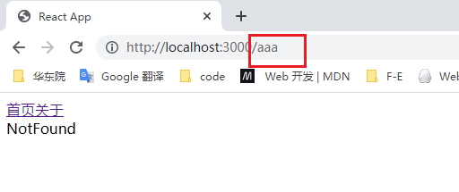

# React-router

## 概念

React-router 和 Vue-router 差不太多、同样也是两种路由模式

- hash模式
- history 模式


React Router的版本4开始，路由不再集中在一个包中进行管理了：

- react-router是router的核心部分代码；

- react-router-dom是用于浏览器的；

- react-router-native是用于原生应用的；


安装react-router

```js
// 安装react-router-dom会自动帮助我们安装react-router的依赖；
yarn add react-router-dom
```


## 基本使用

### `BrowserRouter`或`HashRouter`

- `Router`中包含了对路径改变的监听，并且会将相应的路径传递给子组件；
- `BrowserRouter`使用`history`模式；
- `HashRouter`使用`hash`模式；

### `Link和NavLink`

- 通常路径的跳转是使用Link组件，最终会被渲染成a元素；
- to属性：Link中最重要的属性，用于设置跳转到的路径；

### `Route`

- `Route`用于路径的匹配
- `path`属性：用于设置匹配到的路径
- `component`属性：设置匹配到路径后，渲染的组件；
- `exact`：精准匹配，只有精准匹配到完全一致的路径，才会渲染对应的组件；


```jsx
import React from 'react'
import { NavLink, Route } from 'react-router-dom'
import About from './page/About'
import Home from './page/Home'
export default function App() {
  return (
    <div>
      <NavLink to={"/"}>首页</NavLink>
      <NavLink to={"/about"}>关于</NavLink>

      <Route exact path={"/"} component={Home}></Route>
      <Route path={"/about"} component={About}></Route>
    </div>
  )
}
```


### Switch的作用

有的时候路由匹配可能会匹配多个、比如最后一个组件`NotFound`、应该是前面所有的都没匹配上才会到它、但是**react-router前面匹配上了也会匹配它、同时渲染该组件**

`Switch` 做的就是前面匹配上了就不继续匹配了这件事

```jsx
import React from 'react'
import { NavLink, Route } from 'react-router-dom'
import About from './page/About'
import Home from './page/Home'
import NotFound from './page/NotFound'
export default function App() {
  return (
    <div>
      <NavLink to={"/"}>首页</NavLink>
      <NavLink to={"/about"}>关于</NavLink>

      <Route exact path={"/"} component={Home}></Route>
      <Route path={"/about"} component={About}></Route>
      <Route component={NotFound}></Route>
    </div>
  )
}
```

```jsx
import React from 'react'
import { NavLink, Route, Switch } from 'react-router-dom'
import About from './page/About'
import Home from './page/Home'
import NotFound from './page/NotFound'
export default function App() {
  return (
    <div>
      <NavLink to={"/"}>首页</NavLink>
      <NavLink to={"/about"}>关于</NavLink>
      <Switch>
        <Route exact path={"/"} component={Home}></Route>
        <Route path={"/about"} component={About}></Route>
        <Route component={NotFound}></Route>
      </Switch>

    </div>
  )
}
```




### 路由传参

三种方式

1. ```jsx
   <NavLink to={"/about?name=wan"}>关于</NavLink>
   // about 组件中通过 props.location.search  获取
   ```

2. ```jsx
   import React from 'react'
   import { NavLink, Route, Switch } from 'react-router-dom'
   import About from './page/About'
   import Home from './page/Home'
   import NotFound from './page/NotFound'
   export default function App() {
     return (
       <div>
         <NavLink to={"/"}>首页</NavLink>
         <NavLink to={`/about/${123}`}>关于</NavLink>
         <Switch>
           <Route exact path={"/"} component={Home}></Route>
           <Route path={"/about/:id"} component={About}></Route>
           <Route component={NotFound}></Route>
         </Switch>
   
       </div>
     )
   }
   // about 组件中通过 props.match.params  获取
   ```

3. ```jsx
   import React from 'react'
   import { NavLink, Route, Switch } from 'react-router-dom'
   import About from './page/About'
   import Home from './page/Home'
   import NotFound from './page/NotFound'
   export default function App() {
     return (
       <div>
         <NavLink to={"/"}>首页</NavLink>
         <NavLink to={{
           pathname: "/about",
           search: "name=abc",
           state: { id: 1 }
         }}>关于</NavLink>
         <Switch>
           <Route exact path={"/"} component={Home}></Route>
           <Route path={"/about"} component={About}></Route>
           <Route component={NotFound}></Route>
         </Switch>
   
       </div>
     )
   }
   // about 组件中通过 props.location.search  获取
   ```


## react-router-config

前面的方式处理路由嵌套比较麻烦、需要在组件下面又写一套 `switch`、比较臃肿；所以可以用这个依赖来统一管理路由

```jsx
import React, { PureComponent } from 'react'
import { NavLink, Switch, Route } from 'react-router-dom';
export default class About extends PureComponent {
 
  render() {
    console.log(this.props);
    return (
      <>
        <h1>About</h1>
        <NavLink exact to="/about" >详情</NavLink>
        <NavLink exact to="/about/culture">名单</NavLink>

        <Switch>
          <Route exact path={"/about"} component={Detail}></Route>
          <Route path={"/about/culture"} component={Consumer}></Route>
        </Switch>
      </>
      
    )
  }
}
```


### 安装

```ABAP
yarn add react-router-config
```


### 使用步骤

#### 1：配置映射数组

```js
// 新建文件夹 router/index.js
import About, { Consumer, Detail } from "../page/About";
import Home from "../page/Home";
import NotFound from "../page/NotFound";


const routes = [
    {
        path: "/",
        exact: true,
        component: Home
    },
    {
        path: "/about",
        component: About,
        routes: [
            {
                path: "/about",
                exact: true,
                component: Detail
            },
            {
                path: "/about/culture",
                exact: true,
                component: Consumer
            },
        ]
    },
    {
        component: NotFound
    }
]

export default routes;
```


#### 2：引入renderRoutes方法

`renderRoutes` 替代了 `Switch`

```jsx
import React from 'react'
import { renderRoutes } from 'react-router-config'
import { NavLink } from 'react-router-dom'
import routes from './router'

export default function App() {
  return (
    <div>
      <NavLink to={"/"}>首页</NavLink>
      <NavLink to={"/about"}>关于</NavLink>
      {renderRoutes(routes)}
    </div>
  )
}
```


#### 3：在嵌套的组件中使用`renderRoutes`方法

```jsx
import React, { PureComponent } from 'react'
import { renderRoutes } from 'react-router-config/cjs/react-router-config.min';
import { NavLink, Switch, Route } from 'react-router-dom';

export default class About extends PureComponent {
 
  render() {
    console.log(this.props);
    return (
      <>
        <h1>About</h1>
        <NavLink exact to="/about" >详情</NavLink>
        <NavLink exact to="/about/culture">名单</NavLink>
        {renderRoutes(this.props.route.routes)}
      </>
      
    )
  }
}


export  function Detail() {
  return (
    <h3>Detail</h3>
  )
}

export  function Consumer() {
  const name = ['li', 'wan']
  return (
    <div>
      <ul>
        {name.map((item,index)=>{
          return <li key={index}>item</li>
        })}
      </ul>
    </div>
  )
}
```


### withRouter

**如果非路由组件进入页面的话、props中是没有history属性**、withRouter就是干这事的、这是一个高阶组件、通常用来包裹根组件、后面的组件就可以函数式进入

```jsx
import React from 'react'
import { renderRoutes } from 'react-router-config'
import { } from 'react-router-dom'
import { NavLink, withRouter } from 'react-router-dom'
import routes from './router'

const App = function (props) {
  return (
    <div>
      <NavLink to={"/"}>首页</NavLink>
      <button onClick={e => roterPush()}>关于</button>
      {renderRoutes(routes)}
    </div>
  )
  function roterPush() {
    // 没有withRouter包裹的话、props中没有history属性
    props.history.push("/about");
  }
}

export default withRouter(App)
```

