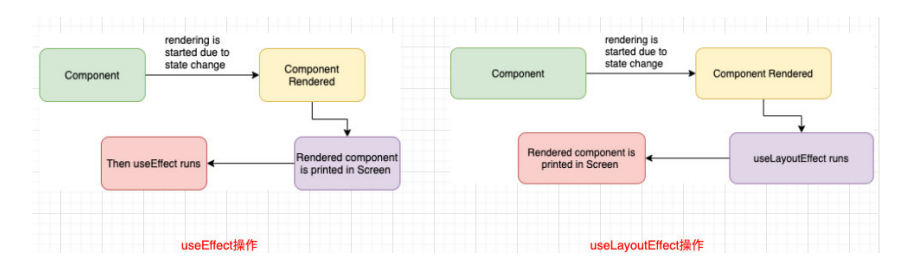

# Hook钩子详解

## 限制

钩子函数不是在哪里都能用的、**只能在 React 的函数组件中调用 Hook。不要在其他 JavaScript 函数中调用。**

**只能在函数最外层调用 Hook。不要在循环、条件判断或者子函数中调用**

## useState

### 参数

- 可以是一个值
- **也可以是一个函数(不需要参数)**

```jsx
const [count, setCount] = useState(0)
const [count, setCount] = useState(() => 0)
```

### 返回值

返回值是数组、包含两个元素、状态值和设置状态值的函数

### set###的复用

和setState一样、分两种：

- **set###参数是值的话、只调用一次**

```jsx
  function handleBtnClick() {
    setCount(count + 10);
    setCount(count + 10);
    setCount(count + 10);
    setCount(count + 10);
   
  }
```


- **set###参数是函数的话、调用多次**

```jsx
  function handleBtnClick() {
    setCount((prevCount) => prevCount + 10);
    setCount((prevCount) => prevCount + 10);
    setCount((prevCount) => prevCount + 10);
    setCount((prevCount) => prevCount + 10);
  }
```


### 引用类型

`setList`参数的类型取决于`useState`参数值得类型、**`setList`是否起作用取决于状态值的内存是否改变**

```jsx
import React, { useState } from 'react'

export default function App() {
  const [list, setList] = useState(['first', 'second', 'three'])
  function addUser() {
    const arr = [...list]
    arr.push('Four')
    setList(arr)
  }
  return (
    <div>
      <h1>人员列表：</h1>
      <ul>
        {
          list.map((item, index) => {
            return <li key={index}>{item}</li>
          })
        }
      </ul>
      <button onClick={e => addUser()}>添加人员</button>
    </div>
  )
}
```


## useEffect

Effect Hook 可以让你来完成一些类似于class中生命周期的功能、比如网络请求、事件监听；

事实上，类似于**网络请求、手动更新DOM、一些事件的监听，都是React更新DOM的一些副作用（Side Effects）**；**所以对于完成这些功能的Hook被称之为 Effect Hook；**


### 执行时机

**useEffect要求我们传入一个回调函数，在React执行完更新DOM操作之后，就会回调这个函数；**

**默认情况下，无论是第一次渲染之后，还是每次更新之后，都会执行这个 回调函数；**


**而我们通过`useState`可以知道、只要执行了`setxxx` 就会重新渲染函数组件、所以就会重新执行`useEffect`**

```jsx
import React, { useEffect, useState } from 'react'

export default function App() {
  const [count, setcount] = useState(0)
  useEffect(() => {
    console.log('useEffect执行了')
  })

  return (
    <div>
      <h1>APP</h1>
      <button onClick={e => setcount(count + 1)}>加1</button>
    </div>
  )
}
```


### useEffect参数解析

两个参数、第一个参数是函数、第二个可选、数组或不写


#### 第一个参数---函数能做的事

- 网络请求
- 更新DOM

这个函数可以返回一个函数、这个**返回的函数通常用来清除副作用**

- 事件监听

  > React 会在组件更新和卸载的时候执行清除操作

  ```jsx
  import React, { useEffect, useState } from 'react'
  
  export default function App() {
    const [count, setcount] = useState(0)
    useEffect(() => {
      console.log('订阅了')
  
      return () => {
        console.log('取消订阅');
      }
    })
  
    return (
      <div>
        <h1>APP</h1>
        <button onClick={e => setcount(count + 1)}>jiayi</button>
      </div>
    )
  }
  ```

  

#### 第二个参数能做的事

这个参数就是控制`useEffect`是否执行（首次除外）具体作用就是该 `useEffect` 在哪些`state`发生变化时，才重新执行；

- **只执行一次---空数组**

​		首次执行一次便不再执行、即使这个组件重新渲染

```jsx
import React, { useEffect, useState } from 'react'

export default function App() {
  console.log('render'); // setcount 就会执行
  const [count, setcount] = useState(0)
  useEffect(() => {
    setTimeout(() => {
      console.log('网络请求'); // 只执行一次
    }, 1000);
  }, [])

  return (
    <div>
      <h1>APP</h1>
      <button onClick={e => setcount(count + 1)}>加1</button>
    </div>
  )
}
```

​		


- **选择性性执行**

​		根据数组中的依赖选择性执行、只有相同的依赖改变了才执行

```jsx
import React, { useEffect, useState } from 'react'

export default function App() {
  console.log('render');
  const [count, setcount] = useState(0)
  const [show, setshow] = useState(true)
  useEffect(() => {
    setTimeout(() => {
      console.log('网络请求');
    }, 1000);
  }, [count]) // 只有 count 改变才会执行

  return (
    <div>
      <h1>APP</h1>
      <button onClick={e => setcount(count + 1)}>加1</button>
      <button onClick={e => setshow(!show)}>切换</button>
    </div>
  )
}
```


- **不写**

​	只要组件渲染就会执行、一般不要这么用

```jsx
import React, { useEffect, useState } from 'react'

export default function App() {
  console.log('render');
  const [count, setcount] = useState(0)
  const [show, setshow] = useState(true)
  useEffect(() => {
    setTimeout(() => {
      console.log('网络请求');
    }, 1000);
  })

  return (
    <div>
      <h1>APP</h1>
      <button onClick={e => setcount(count + 1)}>加1</button>
      <button onClick={e => setshow(!show)}>切换</button>
    </div>
  )
}
```


## useContext

函数组件想用 createContext 跨组件传值、需要多层嵌套、比较麻烦

```jsx
// app.js
import React, { createContext } from 'react'
import About from './page/About'
export const UserContext = createContext()
export const FileContext = createContext()
export default function App() {
  return (
    <UserContext.Provider value={{ name: 'wan', age: 18 }}>
      <FileContext.Provider value={{ height: 1.99 }}>
        <About />
      </FileContext.Provider>
    </UserContext.Provider>
  )
}


// about.js
import React from 'react'
import {UserContext, FileContext} from '../App'

export default function About() {
  
  return (
    <UserContext.Consumer>
      {
        value => {
          console.log('UserContext',value);
          return (
            <FileContext>
              {
                file => {
                  console.log('file', file);
                  return (
                    <h1>about</h1>
                  )
                }
              }
            </FileContext>
          )
        }
      }
    </UserContext.Consumer>
  )
}
```


因此`useContext`就是解决这个问题的

```jsx
import React, {useContext} from 'react'
import {UserContext, FileContext} from '../App'

export default function About() {
  const user = useContext(UserContext)
  const file = useContext(FileContext)
  console.log(user, file);
  return (
    <div>About</div>
  )
}
```


## useReducer

**和`redux`没关系、如果组件具有相同的操作逻辑、并且数据不需要共享、那么可以用这个**；可以替代`useState`

两个参数：

- 第一个参数就是纯函数
- 第二参数是数据、会自动成为第一个参数纯函数的第一个参数

```jsx
import React, {useReducer} from 'react'

function counterReducer (state, action) {
  switch(action.type) {
    case "increment":
      return {...state, counter: state.counter + 1};
    case "decrement":
      return {...state, counter: state.counter - 1};
    default:
      return state;
  }
}
function Home() {
  const [state,dispatch] = useReducer(counterReducer, {counter:0})
  return (
    <div>
      <h1>{state.counter}</h1>
      <button onClick={e => dispatch({type:'increment'})}>+1</button>
      <button onClick={e => dispatch({type:'decrement'})}>-1</button>
    </div>

  )
}
export default function About() {
  const [state,dispatch] = useReducer(counterReducer, {counter:100})
  return (
    <div>
      <h1>{state.counter}</h1>
      <button onClick={e => dispatch({type:'increment'})}>+1</button>
      <button onClick={e => dispatch({type:'decrement'})}>-1</button>
      <hr></hr>
      <Home/>
    </div>

  )
}

```


## useCallback

通常用来做子组件的性能优化、当你传一个函数A给子组件时、父组件重新渲染、函数A也被重新渲染、这样导致子组件也要重新渲染、即便子组件用了memo优化

**useCallback 可以避免函数A被重新渲染、只有当其依赖被更新了、函数A才会被重新渲染**

```jsx
// 不使用useCallback优化
// 点击show切换按钮子组件也会重新执行
import React, {useState, useCallback, memo} from 'react';

const HYButton = memo((props) => {
  console.log("HYButton重新渲染: " + props.title);
  return <button onClick={props.increment}>HYButton +1</button>
});

export default function CallbackHookDemo02() {
  const [count, setCount] = useState(0);
  const [show, setShow] = useState(true);

  const increment1 = () => {
    console.log("执行increment1函数");
    setCount(count + 1);
  }

  return (
    <div>
      <h2>CallbackHookDemo01: {count}</h2>
      <HYButton title="btn1" increment={increment1}/>
      <button onClick={e => setShow(!show)}>show切换</button>
    </div>
  )
}
```


```jsx
// 使用useCallback优化
// 点击show切换按钮、子组件不会重新执行
import React, {useState, useCallback, memo} from 'react';

const HYButton = memo((props) => {
  return <button onClick={props.increment}>HYButton +1</button>
});

export default function CallbackHookDemo02() {
  const [count, setCount] = useState(0);
  const [show, setShow] = useState(true);

  const increment2 = useCallback(() => {
    console.log("执行increment2函数");
    setCount(count + 1);
  }, [count]);

  return (
    <div>
      <h2>CallbackHookDemo01: {count}</h2>
      
      <HYButton title="btn2" increment={increment2}/>
      <button onClick={e => setShow(!show)}>show切换</button>
    </div>
  )
}
```


## `useMemo`

useMemo实际的目的也是为了进行性能的优化。但是这个和上面的不同、具体针对某一个特别复杂的计算

函数、以免它重新渲染


### 不使用`useMemo`优化

- 点击show切换、calcNumber 重新计算

```jsx
import React, {useState, useMemo} from 'react';

function calcNumber(count) {
  console.log("calcNumber重新计算");
  let total = 0;
  for (let i = 1; i <= count; i++) {
    total += i;
  }
  return total;
}

export default function MemoHookDemo01() {
  const [count, setCount] = useState(10);
  const [show, setShow] = useState(true);

  const total = calcNumber(count);

  return (
    <div>
      <h2>计算数字的和: {total}</h2>
      <button onClick={e => setCount(count + 1)}>+1</button>
      <button onClick={e => setShow(!show)}>show切换</button>
    </div>
  )
}
```


### 使用`useMemo`优化

- 点击show切换、calcNumber 不会重新计算
- 只有依赖项 count 改变才会重新计算

```jsx
import React, {useState, useMemo} from 'react';

function calcNumber(count) {
  console.log("calcNumber重新计算");
  let total = 0;
  for (let i = 1; i <= count; i++) {
    total += i;
  }
  return total;
}

export default function MemoHookDemo01() {
  const [count, setCount] = useState(10);
  const [show, setShow] = useState(true);

  const total = useMemo(() => {
    return calcNumber(count);
  }, [count]);

  return (
    <div>
      <h2>计算数字的和: {total}</h2>
      <button onClick={e => setCount(count + 1)}>+1</button>
      <button onClick={e => setShow(!show)}>show切换</button>
    </div>
  )
}
```


## [useRef](https://zh-hans.reactjs.org/docs/hooks-reference.html#useref)

官网有一个例子、这里举一个

```jsx
import React, { useRef, useState, useEffect } from 'react'

export default function RefHookDemo02() {
  const [count, setCount] = useState(0);

  const numRef = useRef(count);

  useEffect(() => {
    console.log(1);
    numRef.current = count;
  }, [count])

  return (
    <div>
      <h2>count上一次的值: {numRef.current}</h2>
      <h2>count这一次的值: {count}</h2>
      <button onClick={e => setCount(count + 10)}>+10</button>
    </div>
  )
}
```


## `useImperativeHandle`

父组件是不能直接传 ref 给函数式子组件的、必须是函数式子组件通过 forwardRef 高阶组件包裹才能传递

```jsx
import React, { PureComponent, createRef, forwardRef } from 'react';

// 高阶组件forwardRef
const Profile = forwardRef(function (props, ref) {
  return <p ref={ref}>Profile</p>
})

export default class App extends PureComponent {
  constructor(props) {
    super(props);

    this.profileRef = createRef();
  }

  render() {
    return (
      <div>
        <Profile ref={this.profileRef} name={"why"} />
        <button onClick={e => this.printRef()}>打印ref</button>
      </div>
    )
  }

  printRef() {
    console.log(this.profileRef.current);
  }
}
```


**但是父组件有的时候想对子组件做一些限制、不希望它随意操作；这个时候可以用`useImperativeHandle`可以值暴露固定的操作**

```jsx
import React, { useRef, forwardRef, useImperativeHandle } from 'react';

const HYInput = forwardRef((props, ref) => {
  const inputRef = useRef();

  useImperativeHandle(ref, () => ({
    focus: () => {
      inputRef.current.focus();
    }
  }), [inputRef])

  return <input ref={inputRef} type="text"/>
})

export default function UseImperativeHandleHookDemo() {
  const inputRef = useRef();

  return (
    <div>
      <HYInput ref={inputRef}/>
      <button onClick={e => inputRef.current.focus()}>聚焦</button>
    </div>
  )
}
```


## useLayoutEffect

**useEffect会在渲染的内容更新到DOM上后执行，不会阻塞DOM的更新；**

**useLayoutEffect会在渲染的内容更新到DOM上之前执行，会阻塞DOM的更新**；如果我们希望在某些操作发生之后再更新DOM，那么应该将这个操作放到useLayoutEffect。




```jsx
import React, { useState, useEffect, useLayoutEffect } from 'react'

export default function LayoutEffectCounterDemo() {
  const [count, setCount] = useState(10);

  useLayoutEffect(() => {
    if (count === 0) {
      setCount(Math.random() + 200)
    }
  }, [count]);

  return (
    <div>
      <h2>数字: {count}</h2>
      <button onClick={e => setCount(0)}>修改数字</button>
    </div>
  )
}
```

