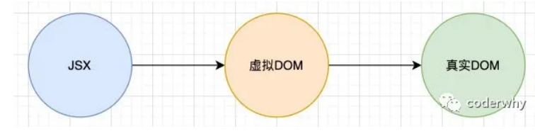
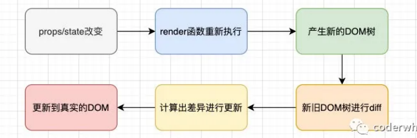

# diff算法

## 更新机制

我们在第二篇文章中了解到 jsx 对象是怎么变成虚拟 DOM 对象的、但是虚拟DOM对象变成真实Dom的呢？这个以后再说、这章主要把Diff算法讲明白




**React的更新机制**




## 了解Diff算法

React在props或state发生改变时，会调用React的render方法，会创建一颗新的Dom树、React需要基于新老Dom树之间的差别来判断如何有效的更新UI：

- 如果一棵树参考另外一棵树进行完全比较更新，那么即使是最先进的算法，该算法的复杂程度为 O(n 3 )，其中 n 是树中元素 的数量；

所以React对这个算法进行了优化、将其优化成了O(n)

1. **对比不同类型的元素**、当节点为不同的元素，React会拆卸原有的树，并且建立起新的树

   1. 当一个元素从  `span`变成`div`，从  `p`变成 `img`，或从 `input` 变成  `button` 都会触发一个完整的重建 流程；
   2. 当卸载一棵树时，对应的DOM节点也会被销毁，组件实例将执行 `componentWillUnmount`() 方法
   3. 当建立一棵新的树时，对应的 DOM 节点会被创建以及插入到 DOM 中，组件实例将执行 `componentWillMount`() 方法， 紧接着 `componentDidMount`() 方法

   

2. 当比对两个相同类型的 React 元素时，React 会保留 DOM 节点，仅比对及更新有改变的属性。

   1. ```jsx
      {/* 如果是Dom元素的话、只修改更改的className */} 
      <div className='box' title='mmm'></div>
      <div className='box1' title='mmm'></div>
      ```

   2. ```jsx
      {
        /* 如果是React 组件的话、组件会保持不变，
          1：React会更新该组件的props，并且调用componentWillReceiveProps() 和 componentWillUpdate() 方法
                  
          2：调用 render() 方法，diff 算法将在之前的结果以及新的结果中进行递归
        */
      }
      <MyButton className='box' mydata={data}></MyButton>
      <MyButton className='box' mydata={data1}></MyButton>
      ```


3. 对子节点进行递归、这个是Diff的精髓
   1. 如果不绑定key、那么子结点都会被重新创建
   2. 绑定了key会寻找key不同的节点创建


