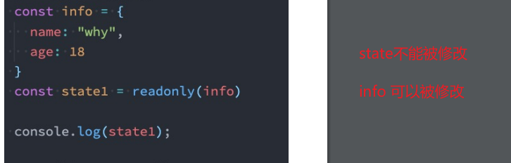
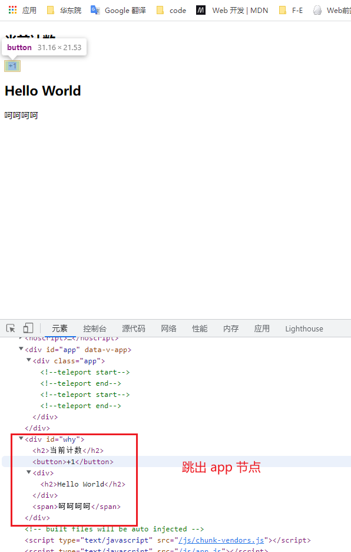

# Vue3

Vue3用setup函数代替了methods、computed、watch、data、生命周期等等、

## setup

### 两个参数 props、context

props：和之前一样、父组件传递过来的属性会被放到props对象中

context：上下文对象、三个属性

- attrs：所有的非prop的attribute
- slots：父组件传递过来的插槽
- emit：当我们组件内部需要发出事件时会用到emit

### 返回值

> setup的返回值可以在模板template中被使用、也就是说我们可以通过setup的返回值来替代 data/methods 选项


### 为什么setup中不能使用 this

> 因为`setup`的调用发生在`data`、`computed`、`methods`被解析之前、所以无法在 `setup` 中被获取


## 响应式API

### `Reactive`

**传入的参数必须是对象或者数组**

```vue
<template>
  <div>
    Home Page
    <h2>{{message}}</h2>
    <h2>当前计数: {{state.counter}}</h2>
    <button @click="increment">+1</button>
  </div>
</template>

<script>
  import { reactive } from 'vue';

  export default {
    props: {
      message: {
        type: String,
        required: true
      }
    },
    setup() {
      const state = reactive({
        counter: 100
      })

      // 局部函数
      const increment = () => {
        state.counter++;
        console.log(state.counter);
      }

      return {
        state,
        increment
      }
    }
  }
</script>

<style scoped>

</style>
```


### Ref

传入的参数没有限制

```vue
<template>
  <div>
    Home Page
    <h2>{{message}}</h2>
    <!-- 当我们在template模板中使用ref对象, 它会自动进行解包 -->
    <h2>当前计数: {{counter}}</h2>
    <!-- ref的解包只能是一个浅层解包(info是一个普通的JavaScript对象) -->
    <h2>当前计数: {{info.counter.value}}</h2>
    <!-- 当如果最外层包裹的是一个reactive可响应式对象, 那么内容的ref可以解包 -->
    <h2>当前计数: {{reactiveInfo.counter}}</h2>
    <button @click="increment">+1</button>
  </div>
</template>

<script>
  import { ref, reactive } from 'vue';

  export default {
    props: {
      message: {
        type: String,
        required: true
      }
    },
    setup() {
      let counter = ref(100);

      const info = {
        counter
      }

      const reactiveInfo = reactive({
        counter
      })

      // 局部函数
      const increment = () => {
        counter.value++;
        console.log(counter.value);
      }

      return {
        counter,
        info,
        reactiveInfo,
        increment
      }
    }
  }
</script>

<style scoped>

</style>
```


需要注意的是：

1. ref 会返回一个可变的响应式对象、无论参数是简单类型函数复杂类型

2. 在 setup 函数内部、要想使用这个值、需要 `ref.value` 指向

   ```js
   let offset = pageInfo.value.currentPage - 1
   ```

3. 在template中不需要使用value、，Vue会自动帮助我们进行解包操作

4. 模板中的解包是浅层的解包


### ref绑定Dom对象

```vue
<template>
  <div>
    <h2 ref="dndnd">哈哈哈哈</h2>
  </div>
</template>

<script>
  import { ref, watchEffect } from 'vue';

  export default {
    setup() {
      const dndnd = ref()
      return {
        dndnd,
      }
    }
  }
</script>

<style scoped>

</style>
```


### readonly

> 不想被别人修改，只读属性；具体规则如下

1. readonly返回的对象都是不允许修改的；
2. readonly处理的原来的对象是允许被修改的；




### toRefs

使用ES6的解构语法，对reactive返回的对象进行解构获取值，那么之后无论是修改结构后的变量，还是修改reactive 返回的state对象，数据都不再是响应式的；使用 `toRefs` 可以响应式结构

```js
const state = reactive({
	name:'why',
	age:18
})


const {name, age} = toRefs(state)
age.value++ // 这个修改、state中的age也会改变
```


#### 原理

`toRefs`的函数，可以将`reactive`返回的对象中的属性都转成`ref`、再次进行结构出来的 `name` 和 `age` 本身都是 `ref` 的


### toRef

单个`reactive`返回的对象中的属性变成 ref、使用这个方法

```js
const state = reactive({
	name:'why',
	age:18
})

const {age} = toRef(state)
age.value++ // 这个修改、state中的age也会改变
```


### computed

两种用法

- 传入一个getter函数、返回一个 ref 对象；但这个**是只读的**
- 传入一个函数，内部含有 getter/setter；这个**可读可写**

**值得注意的是：firstName、lastName 必须是响应的、要不然无法赋值**

```vue
<template>
  <div>
    <h2>{{fullName}}</h2>
    <button @click="changeName">修改firstName</button>
  </div>
</template>

<script>
  import { ref, computed } from 'vue';

  export default {
    setup() {
      const firstName = ref("Kobe");
    
      const lastName = ref("Bryant");

      // 1.用法一: 传入一个getter函数
      // computed的返回值是一个ref对象
      const fullName = computed(() => firstName + " " + lastName);

      // 2.用法二: 传入一个对象, 对象包含getter/setter
      const fullName = computed({
        get: () => firstName.value + " " + lastName.value,
        set(newValue) {
          const names = newValue.split(" ");
          firstName.value = names[0];
          lastName.value = names[1];
        }
      });

      const changeName = () => {
        // firstName.value = "James"
        fullName.value = "coder why";
      }

      return {
        fullName,
        changeName
      }
    }
  }
</script>

<style scoped>

</style>
```


### watchEffect

侦听到某些响应式数据的变化、一开始就会执行一次、然后修改响应数据都会更新；如果想要**停止监听可以调用 watchEffect 返回的函数**

```vue
<template>
  <div>
    <h2>{{name}}-{{age}}</h2>
    <button @click="changeName">修改name</button>
    <button @click="changeAge">修改age</button>
  </div>
</template>

<script>
  import { ref, watchEffect } from 'vue';

  export default {
    setup() {
      // watchEffect: 自动收集响应式的依赖
      const name = ref("why");
      const age = ref(18);

      const stop = watchEffect(() => {
        console.log("name:", name.value, "age:", age.value);
      });

      const changeName = () => name.value = "kobe"
      const changeAge = () => {
        age.value++;
        if (age.value > 25) {
          stop();
        }
      }

      return {
        name,
        age,
        changeName,
        changeAge
      }
    }
  }
</script>

<style scoped>

</style>
```


#### watchEffect 清除副作用

再次执行`watchEffect`监听时、 `onInvalidate`可以当作一参数、并且可以执行

```vue
<template>
  <div>
    <h2>{{name}}-{{age}}</h2>
    <button @click="changeName">修改name</button>
    <button @click="changeAge">修改age</button>
  </div>
</template>

<script>
  import { ref, watchEffect } from 'vue';

  export default {
    setup() {
      // watchEffect: 自动收集响应式的依赖
      const name = ref("why");
      const age = ref(18);

      const stop = watchEffect((onInvalidate) => {
        const timer = setTimeout(() => {
            console.log("name:", name.value, "age:", age.value);
            onsole.log("网络请求成功~");
        }, 2000)

        // 根据name和age两个变量发送网络请求
        onInvalidate(() => {
          // 在这个函数中清除额外的副作用
          // request.cancel()
          clearTimeout(timer);
          console.log("onInvalidate");
        })
      });

      const changeName = () => name.value = "kobe"
      const changeAge = () => {
        age.value++;
        if (age.value > 25) {
          stop();
        }
      }

      return {
        name,
        age,
        changeName,
        changeAge
      }
    }
  }
</script>

<style scoped>

</style>
```


#### watchEffect 执行时机

执行时机与第二个参数有关、第二个参数默认是一个对象、`{flush: "pre"}`  

- flush属性值默认是 pre 时、它会在元素 挂载 或者 更新 之前执行
- flush属性值是 post时、它会在元素 挂载后
- flush属性值是 async时、强制效果始终同步触发。然而，这是低效的，应该很少需要

```
<template>
  <div>
    <h2 ref="title">哈哈哈</h2>
  </div>
</template>

<script>
  import { ref, watchEffect } from 'vue';

  export default {
    setup() {
      const title = ref(null);

      watchEffect(() => {
        console.log(title.value);
      }, {
        flush: "pre" // pre post asyncW
      })

      return {
        title
      }
    }
  }
</script>

<style scoped>

</style>
```


### watch

watch的API和Vue2一样

- watch需要侦听特定的数据源，并在回调函数中执行副作用
- 默认情况下它是惰性的，只有当被侦听的源发生变化时才会执行回调；

与watchEffect的比较，watch允许我们：

- 第一次不会直接执行
- 访问侦听状态变化前后的值；


#### 监听方式

两种监听方式、监听单个与监听多个

#### 监听单个

1. 一个getter函数：但是**该getter函数必须引用可响应式的对象**（比如reactive或者ref）
2. 一个可响应式的对象，reactive或者ref
   - 如果是reactive、那么监听的新旧值都是reactive对象
   - 如果是ref、那么监听的新旧值都是ref.value 值

```vue
<template>
  <div>
    <h2 ref="title">{{info.name}}</h2>
    <button @click="changeData">修改数据</button>
  </div>
</template>

<script>
  import { ref, reactive, watch } from 'vue';

  export default {
    setup() {
      const info = reactive({name: "why", age: 18});

      // 1.侦听watch时,传入一个getter函数
      // watch(() => info.name, (newValue, oldValue) => {
      //   console.log("newValue:", newValue, "oldValue:", oldValue);
      // })

      // 2.传入一个可响应式对象: reactive对象/ref对象
      watch(info, (newValue, oldValue) => {
        console.log("newValue:", newValue, "oldValue:", oldValue);
      })
        
      // const name = ref("why");
      // watch(name, (newValue, oldValue) => {
      //   console.log("newValue:", newValue, "oldValue:", oldValue);
      // })

      const changeData = () => {
        info.name = "kobe";
      }

      return {
        changeData,
        info
      }
    }
  }
</script>

<style scoped>

</style>
```


#### 监听多个

使用数组同时监听多个源

```vue
<template>
  <div>
    <h2 ref="title">{{info.name}}</h2>
    <button @click="changeData">修改数据</button>
  </div>
</template>

<script>
  import { ref, reactive, watch } from 'vue';

  export default {
    setup() {
      // 1.定义可响应式的对象
      const name = ref("why");
      const age = ref(18);

      
      watch([age,name],(newValue,oldValue)=>{
        console.log(newValue,oldValue);
      })
      const changeData = () => {
        age.value++
        name.value = "kobe"
      }

      return {
        changeData,
        info
      }
    }
  }
</script>

<style scoped>

</style>
```


监听对象和数组

```vue
<template>
  <div>
    <h2 ref="title">{{info.name}}</h2>
    <button @click="changeData">修改数据</button>
  </div>
</template>

<script>
  import { ref, reactive, watch } from 'vue';

  export default {
    setup() {
      // 1.定义可响应式的对象
      const info = reactive({name: "why", age: 18});
      const name = ref("why");

      // 2.侦听器watch
      watch([() => ({...info}), name], ([newInfo, newName], [oldInfo, oldName]) => {
        console.log(newInfo, newName, oldInfo, oldName);
      })

      const changeData = () => {
        info.name = "kobe";
      }

      return {
        changeData,
        info
      }
    }
  }
</script>

<style scoped>

</style>
```


## 生命周期

剔除了 `vue2` 的 `beforeCreated`、`created`；其他的变成了 `onX` 函数注册的生命周期钩子；**不需要前两个是因为setup代替了前两个钩子、在之前两个钩子函数中做的事情都可以放到 setup 中去做**

这些函数接受一个回调函数，当钩子被组件调用时将会被执行:

```vue
<template>
  <div>
    <button @click="increment">{{counter}}</button>
  </div>
</template>

<script>
  import { onMounted, onUpdated, onUnmounted, ref } from 'vue';

  export default {
    setup() {
      const counter = ref(0);
      const increment = () => counter.value++
	  // 多个钩子重复不会被覆盖
      onMounted(() => {
        console.log("App Mounted1");
      })
      onMounted(() => {
        console.log("App Mounted2");
      })
      onUpdated(() => {
        console.log("App onUpdated");
      })
      onUnmounted(() => {
        console.log("App onUnmounted");
      })

      return {
        counter,
        increment
      }
    }
  }
</script>

<style scoped>

</style>
```


## Provide函数

替代之前的Provide 和 Inject 的选项、参数可以看成是键值对模式

```vue
<template>
  <div>
    <home/>
    <h2>App Counter: {{counter}}</h2>
    <button @click="increment">App中的+1</button>
  </div>
</template>

<script>
  import { provide, ref, readonly } from 'vue';

  import Home from './Home.vue';

  export default {
    components: {
      Home
    },
    setup() {
      const name = ref("coderwhy");
      let counter = ref(100);

      provide("name", readonly(name));
      provide("counter", readonly(counter));

      const increment = () => counter.value++;

      return {
        increment,
        counter
      }
    }
  }
</script>

<style scoped>

</style>
```

```vue
<template>
  <div>
    <h2>{{name}}</h2>
    <h2>{{counter}}</h2>

    <button @click="homeIncrement">home+1</button>
  </div>
</template>

<script>
  import { inject } from 'vue';

  export default {
    setup() {
      const name = inject("name");
      const counter = inject("counter");

      const homeIncrement = () => counter.value++

      return {
        name,
        counter,
        homeIncrement
      }
    }
  }
</script>

<style scoped>

</style>
```


## hook

> 我自己认为hook方式就是让代码看起来简洁、就像之前引入工具函数一样。没有必要什么都在一个组件下面写；其中最不一样的就是、hook中的数据具有响应式

hook中的数据具有响应式、导出去再在组件中导进来

```js
// useCount.js
import { ref, computed } from 'vue';

export default function() {
  const counter = ref(0);
  const doubleCounter = computed(() => counter.value * 2);

  const increment = () => counter.value++;
  const decrement = () => counter.value--;

  return {
    counter, 
    doubleCounter, 
    increment, 
    decrement
  }
}

// App.vue
setup() {
    const {counter, doubleCounter, increment, decrement } = useCount()
    
    ......
   
   	return {counter, doubleCounter, increment, decrement }
}
```


## 顶层setup

目前稳定版本没有、不要再项目中使用<script setup>

- <script setup> 开头

- 不是 `export default function`

- 组件只需要引入、不需要注册

```vue
<template>
  <div>
    <h2>当前计数: {{counter}}</h2>
    <button @click="increment">+1</button>

    <hello-world message="呵呵呵" @increment="getCounter"></hello-world>
  </div>
</template>

<script setup>
  import { ref } from 'vue';
  import HelloWorld from './HelloWorld.vue';

  const counter = ref(0);
  const increment = () => counter.value++;

  const getCounter = (payload) => {
    console.log(payload);
  }
</script>

<style scoped>

</style>


<template>
  <div>
    <h2>Hello World</h2>
    <h2>{{message}}</h2>
    <button @click="emitEvent">发射事件</button>
  </div>
</template>

<script setup>
  // 顶层自带这两个、可以不用引入
  // import { defineProps, defineEmit } from 'vue';

  const props = defineProps({
    message: {
      type: String,
      default: "哈哈哈"
    }
  })

  const emit = defineEmits(["increment", "decrement"]);

  const emitEvent = () => {
    emit('increment', "100000")
  }
  
</script>

<style scoped>

</style>
```


## h函数

h() 函数是一个用于创建 vnode 的一个函数

接受三个参数：

1. 一个html标签名、一个组件、一个异步组件、一个函数式、或者一个函数式组件
2. attribute、props属性
3. 文本或者插槽对象

```vue
<script>
  import { ref, h } from 'vue';

  export default {
    setup() {
      const counter = ref(0);
      
      return () => {
        return h("div", {class: "app"}, [
          h("h2", null, `当前计数: ${counter.value}`),
          h("button", {
            onClick: () => counter.value++
          }, "+1"),
          h("button", {
            onClick: () => counter.value--
          }, "-1"),
        ])
      }
    }
  }
</script>

<style scoped>

</style>
```


插槽形式

```vue
<script>
  import { h } from 'vue';
  import HelloWorld from './HelloWorld.vue';

  export default {
    render() {
      return h("div", null, [
        h(HelloWorld, null, {
          default: props => h("span", null, `app传入到HelloWorld中的内容: ${props.name}`)
        })
      ])
    }
  }
</script>

<style scoped>

</style>


<script>
  import { h } from "vue";

  export default {
    render() {
      return h("div", null, [
        h("h2", null, "Hello World"),
        this.$slots.default ? this.$slots.default({name: "coderwhy"}): h("span", null, "我是HelloWorld的插槽默认值")
      ])
    }
  }
</script>

<style lang="scss" scoped>

</style>
```


## 自定义钩子

### 默认实现

```vue
<template>
  <div>
    <input type="text" ref="input">
  </div>
</template>

<script>
  import { ref, onMounted, watchEffect } from "vue";

  export default {
    setup() {
      const input = ref(null);

      onMounted(() => {
        input.value.focus();
      })
      // 两种实现方式
      watchEffect(()=>{
        input.value.focus()
      },{
        flush:"post"
      })

      return {
        input
      }
    }
  }
</script>

<style scoped>

</style>
```


### 局部指令

提供了 `directives` 选项、钩子函数参数的bindings可以拿到指令的修饰符和绑定值

```vue
<template>
  <div>
    <button v-if="counter < 2" v-why.aaaa.bbbb="'coderwhy'" @click="increment">当前计数: {{counter}}</button>
  </div>
</template>

<script>
  import { ref } from "vue";

  export default {
    // 局部指令
    directives: {
      why: {
        created(el, bindings, vnode, preVnode) {
          console.log("why created",{ el, bindings, vnode, preVnode});
          console.log(bindings.value);
          console.log(bindings.modifiers);
        },
        beforeMount() {
          console.log("why beforeMount");
        },
        mounted() {
          console.log("why mounted");
        },
        beforeUpdate() {
          console.log("why beforeUpdate");
        },
        updated() {
          console.log("why updated");
        },
        beforeUnmount() {
          console.log("why beforeUnmount");
        },
        unmounted() {
          console.log("why unmounted");
        }
      }
    },
    setup() {
      const counter = ref(0);
      const increment = () => counter.value++;

      return {
        counter,
        increment
      }
    }
  }
</script>

<style scoped>

</style>
```


### 全局指令

全局指令通过 `directive` 实现

```vue
import dayjs from 'dayjs';

export default function(app) {
  app.directive("format-time", {
    created(el, bindings) {
      bindings.formatString = "YYYY-MM-DD HH:mm:ss";
      if (bindings.value) {
        bindings.formatString = bindings.value;
      }
    },
    mounted(el, bindings) {
      const textContent = el.textContent;
      let timestamp = parseInt(textContent);
      if (textContent.length === 10) {
        timestamp = timestamp * 1000
      }
      el.textContent = dayjs(timestamp).format(bindings.formatString);
    }
  })
}

<template>
  <h2 v-format-time="'YYYY/MM/DD'">{{timestamp}}</h2>

  <h2 v-format-time>{{timestamp}}</h2>
  <h2 v-format-time>{{timestamp}}</h2>
  <h2 v-format-time>{{timestamp}}</h2>
  <h2 v-format-time>{{timestamp}}</h2>
  <h2 v-format-time>{{timestamp}}</h2>

</template>

<script>
  export default {
    setup() {
      const timestamp = 1624452193;

      return {
        timestamp
      }
    },
    mounted() {
      console.log("app mounted");
    }
  }
</script>

<style scoped>

</style>
```


## Teleport

平时写代码都是一层套一层的、teleport可以让我们跳出当前DOM、它会创建一个新的DOM出来

```vue
<template>
  <div class="app">
    <teleport to="#why">
      <h2>当前计数</h2>
      <button>+1</button>
      <hello-world></hello-world>
    </teleport>

    <teleport to="#why">
      <span>呵呵呵呵</span>
    </teleport>
  </div>
</template>

<script>
  import HelloWorld from './HelloWorld.vue';
  export default {
    components: {
      HelloWorld
    },
  }
</script>

```




## Vue插件

向Vue全局添加一些功能时，会采用插件的模式，它有两种编写方式

- 对象类型：一个对象，但是**必须包含一个 install 的函数**，该函数会在安装插件时执行
- 函数类型：一个function，这个函数会在安装插件时自动执行；

插件可以完成的功能没有限制、以下都可以实现：

1. 添加全局方法或者 property，通过把它们添加到 config.globalProperties 上实现
2. 一个库，提供自己的 API，同时提供上面提到的一个或多个功能
3. 添加全局资源：指令/过滤器/过渡等
4. 通过全局 mixin 来添加一些组件选项

```js
// pluginObject.js
export default {
  install(app) {
    app.config.globalProperties.$name = "coderwhy"
  }
}
// pluginFunction.js
export default function(app) {
  console.log(app);
}

// main.js
import { createApp } from 'vue'
import App from './04_teleport内置组件/App.vue'
import pluginObject from './plugins/plugins_object'
import pluginFunction from './plugins/plugins_function'

const app = createApp(App);

app.use(pluginObject); // 全局注册
app.use(pluginFunction); // 全局注册

app.mount('#app');

```


**在组件中拿到全局app的属性需要另一个api**  `getCurrentInstance`

```vue
<template>
  <div class="app">
  </div>
</template>

<script>
  import { getCurrentInstance } from "vue";


  export default {
    components: {
      HelloWorld
    },
    setup() {
      const instance = getCurrentInstance();
      console.log(instance.appContext.config.globalProperties.$name);
    },
  }
</script>
```


## Vuex的使用

先简单介绍下vuex

### Vuex在vue2中的的使用

#### 创建

```js
import { createStore } from "vuex"
const store = createStore({
	state(){
		return {
			count: 0 // 数据
		}
	},
	getters: {
        // 类似于计算属性
        dobuleCount(state, getters){
            return state.count * 2
        }
	},
	mutations: {
		// 同步方法、playload就是commit过来的参数
        increment(state,playload)
            state.count++
        }
	},
	actions: {
    	// 异步操作、获取到数据在这里执行commit改变state中的数据
                          
        // context 与 store类似；playload参数
        decrementAction(context, playload)
    		axios(url).then(res => {
                context.commit('decrement', res)
            })
    		
		}
	
	}
})

export default store;

// main.js
import store from './store'
createApp(App).use(store).mount('#app')
```


#### 使用

- 改变state的值、只能靠`$store.commit`去执行

```vue
<template>
  <home/>
  <h2>App:{{ $store.state.counter }}</h2>
  <h2>Getters:{{ $store.getters.dobuleCount }}</h2>
  <button @click="increment">+1</button>
  <button @click="decrement">-1</button>
</template>

<script>
import Home from './pages/Home.vue'

export default {
  name: "App",
  components: {
    Home
  },
  methods: {
    increment() {
      this.$store.commit("increment")
    },
    decrement() {
      this.$store.commit("decrement")
    },
     decretmentAction() {
       this.$store.dispatch("decrementAction")
     }
     
  },
};
</script>

<style>
#app {
  font-family: Avenir, Helvetica, Arial, sans-serif;
  -webkit-font-smoothing: antialiased;
  -moz-osx-font-smoothing: grayscale;
  text-align: center;
  color: #2c3e50;
  margin-top: 60px;
}
</style>

```


#### 辅助函数

##### mapState、mapGetters、mapActions

两种使用方式：数组和对象；`mapState / mapGetters / mapActions` 返回一个对象、对象中的属性值都是computeed函数

```vue
<template>
  <div>
    <h2>Home:{{ $store.state.counter }}</h2>
    <h2>Home:{{ sCounter }}</h2>
    <h2>Home:{{ sName }}</h2>
    <h2>Home:{{ age }}</h2>
    <h2>Home:{{ height }}</h2>
    <button @click="incrementAction">提交</h2>
  </div>
</template>

<script>
  import { mapState, mapGetters } from 'vuex'

  export default {
    computed: {
      fullName() {
        return "Kobe Bryant"
      },
      // 其他的计算属性, 从state获取
      ...mapState(["counter", "name", "age", "height"])
      // 解构就会变成下面这种、this就是 store
      counter: function() {
      	return this.state.counter
  	  }
    
    
      ...mapState({
        sCounter: state => state.counter,
        sName: state => state.name
      })
    
      ...mapGetters(["nameInfo", "ageInfo", "heightInfo"]),
      ...mapGetters({
        sNameInfo: "nameInfo",
        sAgeInfo: "ageInfo"
      })
    },
    methods: {
        ...mapActions(["incrementAction", "decrementAction"])
    }
  }
</script>

<style scoped>

</style>
```


### Vuex在Vue3中的使用

Vue3中没有this、但却提供了 `useStore` 让我们获取 `store` 对象

- 少部分就可以用`computed`获取

- 大部分的值需要辅助函数、在上面我们知道`mapState`返回的对象还是需要 `this` 的、所以用`bind`显示绑定 `this` 、再用`computed`返回

```vue
<template>
  <div>
    <h2>Home:{{ $store.state.counter }}</h2>
    <hr>
    <h2>{{sCounter}}</h2>
    <h2>{{counter}}</h2>
    <h2>{{name}}</h2>
    <h2>{{age}}</h2>
    <h2>{{height}}</h2>
    <hr>
  </div>
</template>

<script>
  import { mapState, useStore, mapActions  } from 'vuex'
  import { computed } from 'vue'

  export default {

    setup() {
      const store = useStore()
      // 少部分就可以用computed获取
      const sCounter = computed(() => store.state.counter)
      const sName = computed(() => store.state.name)

      
      // 大部分的值需要辅助函数、在上面我们知道mapState返回的对象还是需要this的、所以用bind显示绑定 this 、再用computed返回
      const storeStateFns = mapState(["counter", "name", "age", "height"])

      const storeState = {}
      Object.keys(storeStateFns).forEach(fnKey => {
        const fn = storeStateFns[fnKey].bind({$store: store})
        storeState[fnKey] = computed(fn)
      })
        
       // store 中的 action 函数
       const actions = mapActions(["incrementAction", "decrementAction"])

      return {
        sCounter,
        ...storeState,
        ...actions
      }
    }
  }
</script>

<style scoped>

</style>
```


#### 辅助函数 hook 用法

```js
// useGetters.js
import { computed } from 'vue'
import { mapGetters, useStore } from 'vuex'

export function useGetters(mapper) {
  // 拿到store独享
  const store = useStore()

  // 获取到对应的对象的functions: {name: function, age: function}
  const storeStateFns = mapGetters(mapper)

  // 对数据进行转换
  const storeState = {}
  Object.keys(storeStateFns).forEach(fnKey => {
    const fn = storeStateFns[fnKey].bind({$store: store})
    storeState[fnKey] = computed(fn)
  })

  return storeState
}

// app.vue
setup() {
  const storeState = useState(["counter", "name", "age", "height"])
  const storeState2 = useState({
     sCounter: state => state.counter,
     sName: state => state.name
  })

  return {
    ...storeState,
    ...storeState2
  }
}

```

