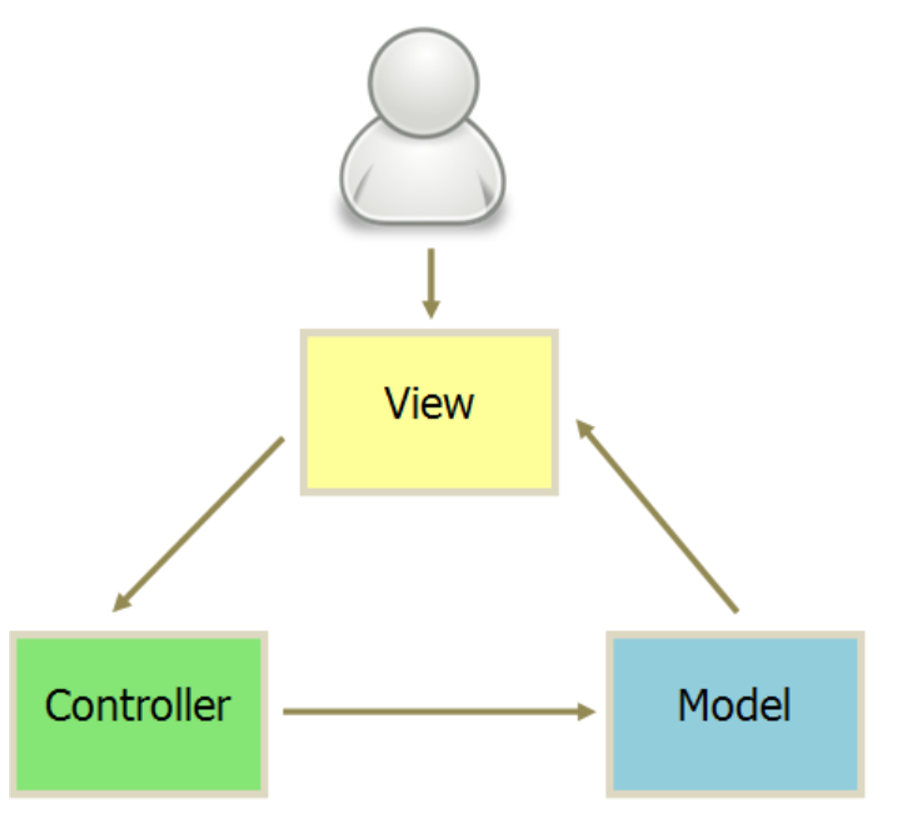

# MVC的实现




## 架构

`Model`：

数据模型，对数据增删改查

`View`：

视图层

`Controller`：

逻辑层，数据和视图关联挂载和基本的逻辑操作


## 案例

一个计算器案例，手动实现MVC

### model层

- 通过`Object.defineProperty`给`data`对象增加`getter`和`setter`

```js
var model = {
        data: {
            a: 0,
            b: 0,
            s: '+',
            r: 0
        },

        init: function () {
            var _this = this;

            for (var k in _this.data) {
                (function (k) {
                    Object.defineProperty(_this, k, {
                        get: function () {
                            // model.a -> get
                            return _this.data[k];
                        },
                        set: function (newValue) {
                            // model.a = 123; -> set
                            _this.data[k] = newValue;
                            view.render({
                                [k]: newValue
                            })
                        }
                    })
                })(k)
            }
        }
    }
```


### view层

- 第一次更新视图先利用正则把`mustache`语法转为正常数据
- 后面更新视图就是通过数据来更新了

```js
    var view = {
        el: '#app',
        template: `
        <p>
          <span class="cal-a">{{ a }}</span>
          <span class="cal-s">{{ s }}</span>
          <span class="cal-b">{{ b }}</span>
          <span>=</span>
          <span class="cal-r">{{ r }}</span>
        </p>
        <p>
          <input type="text" placeholder="Number a"  class="cal-input a" />
          <input type="text" placeholder="Number b"  class="cal-input b" />
        </p>
        <p>
          <button class="cal-btn">+</button>
          <button class="cal-btn">-</button>
          <button class="cal-btn">*</button>
          <button class="cal-btn">/</button>
        </p>
      `,
        render: function (mutedData) {
            // 
            if (!mutedData) {
                this.template = this.template.replace(/\{\{(.*?)\}\}/g, function (node, key) {
                    return model[key.trim()];
                })

                var container = document.createElement('div');
                container.innerHTML = this.template;
                document.querySelector(this.el).appendChild(container);
            } else {
                for (var k in mutedData) {
                    document.querySelector('.cal-' + k).textContent = mutedData[k];
                }
            }
        }
    }
```


### control

```js
var controller = {
        init: function () {
            var oCalInputs = document.querySelectorAll('.cal-input'),
                oCalBtns = document.querySelectorAll('.cal-btn'),
                btnItem,
                inputItem;

            for (var i = 0; i < oCalInputs.length; i++) {
                inputItem = oCalInputs[i];

                inputItem.addEventListener('input', this.handleInput, false);
            }

            for (var i = 0; i < oCalBtns.length; i++) {
                btnItem = oCalBtns[i];

                btnItem.addEventListener('click', this.handelBtnClick, false);
            }
        },
        handleInput: function (e) {
            var tar = e.target,
                value = Number(tar.value),
                field = tar.className.split(' ')[1];

            model[field] = value;

            // with (model) {
            // r = eval('a' + s + 'b');
            model.r = eval('model.a' + model.s + 'model.b');
            // }
        },
        handelBtnClick: function (e) {
            var type = e.target.textContent;

            model.s = type;

            model.r = eval('model.a' + model.s + 'model.b');
        }
    }
```


## 完整代码

```js
;
(function () {

    function init() {
        model.init(); // 组织数据 + 数据监听操作 / 数据代理
        view.render(); // 组织HTML模板 + 渲染HTML模板
        controller.init(); // 事件处理函数定义与绑定
    }

    var model = {
        data: {
            a: 0,
            b: 0,
            s: '+',
            r: 0
        },

        init: function () {
            var _this = this;

            for (var k in _this.data) {
                (function (k) {
                    Object.defineProperty(_this, k, {
                        get: function () {
                            // model.a -> get
                            return _this.data[k];
                        },
                        set: function (newValue) {
                            // model.a = 123; -> set
                            _this.data[k] = newValue;
                            view.render({
                                [k]: newValue
                            })
                        }
                    })
                })(k)
            }
        }
    }

    var view = {
        el: '#app',
        template: `
        <p>
          <span class="cal-a">{{ a }}</span>
          <span class="cal-s">{{ s }}</span>
          <span class="cal-b">{{ b }}</span>
          <span>=</span>
          <span class="cal-r">{{ r }}</span>
        </p>
        <p>
          <input type="text" placeholder="Number a"  class="cal-input a" />
          <input type="text" placeholder="Number b"  class="cal-input b" />
        </p>
        <p>
          <button class="cal-btn">+</button>
          <button class="cal-btn">-</button>
          <button class="cal-btn">*</button>
          <button class="cal-btn">/</button>
        </p>
      `,
        render: function (mutedData) {
            if (!mutedData) {
                this.template = this.template.replace(/\{\{(.*?)\}\}/g, function (node, key) {
                    console.log(key, node);
                    return model[key.trim()];
                })

                var container = document.createElement('div');
                container.innerHTML = this.template;
                document.querySelector(this.el).appendChild(container);
            } else {
                for (var k in mutedData) {
                    document.querySelector('.cal-' + k).textContent = mutedData[k];
                }
            }
        }
    }

    var controller = {
        init: function () {
            var oCalInputs = document.querySelectorAll('.cal-input'),
                oCalBtns = document.querySelectorAll('.cal-btn'),
                btnItem,
                inputItem;

            for (var i = 0; i < oCalInputs.length; i++) {
                inputItem = oCalInputs[i];

                inputItem.addEventListener('input', this.handleInput, false);
            }

            for (var i = 0; i < oCalBtns.length; i++) {
                btnItem = oCalBtns[i];

                btnItem.addEventListener('click', this.handelBtnClick, false);
            }
        },
        handleInput: function (e) {
            var tar = e.target,
                value = Number(tar.value),
                field = tar.className.split(' ')[1];

            model[field] = value;

            // with (model) {
            // r = eval('a' + s + 'b');
            model.r = eval('model.a' + model.s + 'model.b');
            // }
        },
        handelBtnClick: function (e) {
            var type = e.target.textContent;

            model.s = type;

            model.r = eval('model.a' + model.s + 'model.b');
        }
    }

    init();
})();
```

