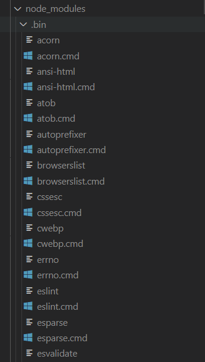
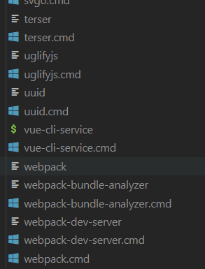

# npm run xxx 后面呢

以 vue 项目举例

我们再执行vue项目时会通过执行脚本命令来跑项目

`package.json`

```json
"scripts": {
    "serve": "vue-cli-service serve",
  },
```


执行 `npm run serve` 其实就是执行 `vue-cli-service serve`、其中`serve`是参数；但是我们知道`vue-cli-service`不是全局命令、那为什么还能成功呢？


我们再去全局的搜索一下 `vue-cli-service`、能够发现这是`vue-cli`的依赖、也就是说在执行`npm i` 的时候把这个依赖安上了

```json
  "devDependencies": {
    "@vue/cli-service": "~4.5.14",
  },
```


那为什么执行 `npm run serve`就能跑成功呢？上面的解释好像没有什么关系。目前看是这样的、接着往下看


npm这个包管理工具在安装每个依赖的时候会在它的bin文件夹下面创建几个与依赖相关的文件、

**.bin 目录，这个目录不是任何一个 npm 包。目录下的文件，表示这是一个个软链接，打开文件可以看到文件顶部写着 `#!/bin/sh` ，表示这是一个脚本。**


**由此我们可以知道，当使用 `npm run serve` 执行 `vue-cli-service  serve` 时，虽然没有安装 `vue-cli-service`的全局命令，但是 npm 会到 `./node_modules/.bin` 中找到 `vue-cli-service` 文件作为  脚本来执行，则相当于执行了 `./node_modules/.bin/vue-cli-service serve`**






