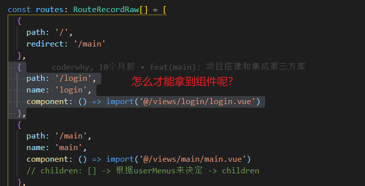

# require.context()实现自动化注册路由

之前在vue-router中的学习知道了`addRoutes`可以注册路由、只需要其参数和路由对象一致即可；那么问题来了、怎么拿到具体组件文件？




这个时候就需要require.context()和require()异步导入组件合作了


## require.context

**参数**

- 需要检索的目录
- 是否检索子目录
- 匹配文件的正则表达式

**返回值**

- 返回了一个函数 `function webpackContext(req) {return __webpack_require__(webpackContextResolve(req))};`

这个函数有三个属性

- resolve: 是一个函数，他返回的是被解析模块的id ，接受一个参数request。
- **keys: 也是一个函数，他返回的是一个数组，该数组是由所有可能被上下文模块解析的请求对象组成**
-  id：上下文模块的id


### 应用场景

重复引用过于麻烦

```js
import aaa from '@/components/login/aaa'
import bbb from '@/components/login/bbb'
import ccc from '@/components/login/ccc'
import ddd from '@/components/login/ddd'
components:{
    aaa,
    bbb,
    ccc,
    ddd,
}
```

`require.context` 很快

```js
const path = require('path')
const files = require.context('@/components/login', false, /\.vue$/)
const modules = {}
files.keys().forEach(key => {
  // key对象中的属性 包含了组件的具体路径
  // aaa组件：/components/login/aaa
 
})

```


## 路由自动化注册

上面介绍了`require.context` 的用法可以拿到组件的路径、后面我只要通过require拿到具体的异步组件就可以实现路由自动化注册了

```ts
  const routes: RouteRecordRaw[] = []

  // 1.先去加载默认所有的routes
  const allRoutes: RouteRecordRaw[] = []
  const routeFiles = require.context('../router/main', true, /\.ts/)
  routeFiles.keys().forEach((key) => {
    const route = require('../router/main' + key.split('.')[1])
    allRoutes.push(route.default)
  })

return routes
// vuex中登录
routes.forEach((route) => {
   router.addRoute('main', route)
})
```


## 实现路由自动化注册需要注意的点

```js
const routeFiles = require.context('../router/main', true, /\.ts/)
```


```js
const dashboard = () => import('@/views/main/analysis/dashboard/dashboard.vue')
export default {
  path: '/main/analysis/dashboard',
  name: 'dashboard',
  component: dashboard,
  children: []
}
```

1. 获取的.ts 文件是有要求的、应该是如上面一样的、这个文件已经获取了路由组件

2. `const route = require('../router/main' + key.split('.')[1])`拿到的就是ts文件导出的对象、这样的形式与addRoute参数所需要的是一致的才能自动化注册

   ```js
   {
     path: '/main/analysis/dashboard',
     name: 'dashboard',
     component: dashboard,
     children: []
   }
   ```

   