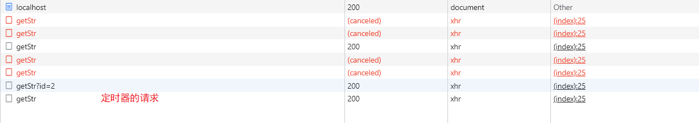

# 取消重复请求处理

取消重复请求是对于减少HTTP请求的一个处理、相比于防抖节流来说是更加自动化的、这篇文章会从`xhr`、`fetch`、`axios`三个方向来实现这个需求、并会基于原生的`xhr`实现取消重复请求


## `xhr`的取消原理

`xhr`也就是`XMLHttpRequest`类的实例、提供了一个`api abort`取消请求

```js
const xhr = new XMLHttpRequest()
var method = "GET",
    url = '/getStr'
xhr.open(method, url, true);
xhr.onreadystatechange = (state) => {
    if (xhr.readyState === 4 && (xhr.status === 200)) {
        console.log(xhr.responseText);
     }
}
xhr.abort()
```


## Fetch的取消原理

与上面类似、提供了一个`AbortController`类、并且具有`abort api`

```js
const controller = new AbortController();
const signal = controller.signal;
signal.addEventListener("abort", function (e) {
    console.log(signal, "signal的中断状态");
});


fetch("/getStr", { signal })
     .then((res) => {
        console.log(res, "请求成功");
      }).catch(function (thrown) {
        console.log(thrown);
      });
// 增加部分结束
controller.abort({
   name: "CondorHero",
   age: 19
});
```


## `Axios`的取消原理

`Axios`库利用`axios.CancelToken`来取消请求

```js
// 取消请求
  function send() {
    let cancel = null;
    return function () {
      if(cancel !== null) {
        cancel();
      }
      axios.request({
        method: 'GET',
        url: '/xxxx',
        cancelToken: new axios.CancelToken((c)=> {
          cancel = c;
        })
      }).then((respone)=> {
        console.log(respone)
        // 处理完成 初始化null
        cancel = null;
      })
    }
  }
```


## 手动实现取消重复请求

重复请求的特点肯定是`url`是一样的、参数是一样的、所以我们只需要判断这两样东西是不是相等即可

- 定义一个全局的对象存储`url`
- 判断对象是否具有`url`、有的话取消请求

```js
        const urlMap = {}
        function getHttp(url) {
            const xhr = new XMLHttpRequest()
            var method = "GET"
            if (urlMap[url]) {
                urlMap[url] = urlMap[url] + 1
            } else {
                urlMap[url] = 1
            }
            xhr.open(method, url, true);

            xhr.send({ age: 90 });
            xhr.onreadystatechange = (state) => {
                if (xhr.readyState === 4 && (xhr.status === 200)) {
                    // 请求成功了就删除记录
                    delete urlMap[url]
                    console.log(xhr.responseText);
                }
            }
            if (urlMap[url] !== 1) {
                // 说明之前已经请求了、无需再请求
                xhr.abort()
            }
        }

        getHttp('http://localhost:8000/getStr')
        getHttp('http://localhost:8000/getStr')
        getHttp('http://localhost:8000/getStr')
        getHttp('http://localhost:8000/getStr')
        getHttp('http://localhost:8000/getStr')
        getHttp('http://localhost:8000/getStr?id=2')

        setTimeout(() => {
            getHttp('http://localhost:8000/getStr')
        }, 3000);
```




## 服务端代码

```js

const express = require('express');

const app = express();
app.get("/getStr", (req, res, next) => {
    setTimeout(() => {
        res.end("hello express");
    }, 1000);

});

app.use(express.static('./build'));

app.listen(8000, () => {
    console.log("路由服务器启动成功~");
});
```

