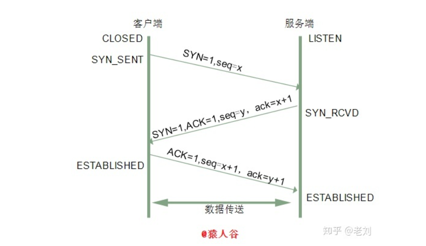
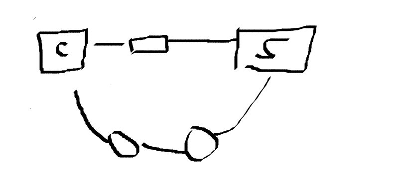
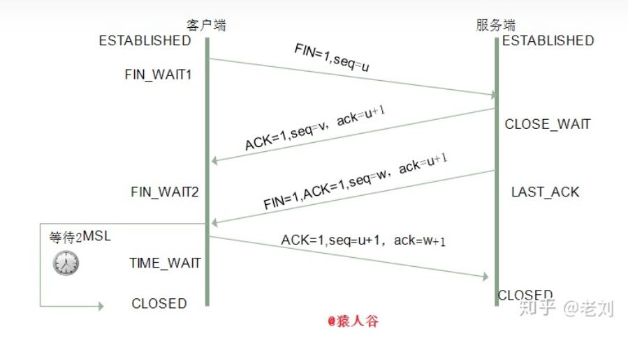

# 三次握手与四次挥手

[TOC]

## 三次握手

**三次握手就是指建立一个TCP连接时，需要客户端和服务器总共发送三个包。进行三次握手的主要作用就是为了确认双方的接受能力和发送能力是否正常**、指定自己的初始化序列号为后面的可靠传输做准备。

实质上就是连接服务器指定端口、建立TCP连接、同步连接双方的序列号和确认号、交换TCP窗口的大小信息


### 三次握手具体步骤

刚开始客户端处于Closed 的状态、服务的处于 Listen 状态

**第一次握手：**

- 客户端发一个SYN报文、并指明客户端的初始化序列号ISN©。
- 这个时候客户端的状态处于 SYN_SENT 状态
- 首部的同步位SYN=1，初始序号 seq =x，SYN=1的报文段不能携带数据，但要消耗掉一个序号。


**第二次握手：**

- 服务器收到客户端的 SYN 报文后，会以自己的 SYN 报文作为应答，并指明自己的初始化序列号 ISN(s)
- 同时会把客户端的 ISN(初始化序列号) + 1 作为 ACK 的值，表示自己已经收到了客户端的 SYN 
- 这个时候服务端处于 SYN_REVD(**received**) 的状态
- 确认报文段中SYN=1，ACK=1，确认号ack=x+1，初始序号seq=y。


**第三次握手：**

- 客户端收到 SYN 报文之后，会发送一个确认的确认 ACK 报文
- 一样把服务器的 ISN + 1 作为 ACK 的值，表示已经收到了服务端的 SYN 报文
- 客户端处于 ESTABLISHED 状态。服务器收到 ACK 报文之后，也处于 ESTABLISHED 状态，此时，双方已建立起了连接。
- 确认报文没有 SYN, 确认报文段ACK=1，确认号ack=y+1（**值就是第二次握手确认报文段的序列号加1**），序号seq=x+1（**值就是第二次握手确认报文段的确认号**），ACK报文段可以携带数据，不携带数据则不消耗序号。




### 两次握手不行吗？



如上图所示， C盒子表示客户端，S 表示服务端，中间的表示路由器；

**如果只有两次握手会出现下面这种情况：**

- 第一次请求连接走的是下面这个路由，路有个数比较多，时间比较长
- 客户端等不及了，第二次请求走的是上面的路由，发送报文，确认报文两次握手结束；
- 下面那个终于到了服务端，服务端把确认报文发给客户端，但是客户端会忽略发过来的确认（我都已经连上了，你还来干啥？），也不发送数据。则服务端一致等待客户端发送数据，浪费资源。


### 半连接队列

服务器第一次收到客户端的 SYN 之后，就会处于 **SYN_RCVD 状态**，此时双方还没有完全建立其连接，**服务器会把此种状态下请求连接放在一个队列里**，我们把这种队列称之为半连接队列。


### 全连接队列

**已经完成三次握手**，建立起连接的就会放在全连接队列中。如果队列满了就有可能会出现丢包现象。


### SYN-ACK 重传次数

服务器发送完SYN-ACK包，**如果未收到客户确认包**，**服务器进行首次重传**，等待一段时间仍未收到客户确认包，进行第二次重传。如果重**传次数超过系统规定的最大重传次数，系统将该连接信息从半连接队列中删除。**

注意，每次重传等待的时间不一定相同，一般会是指数增长，例如间隔时间为 1s，2s，4s，8s…


### ISN(Initial Sequence Number)是固定的吗？

不是

当一端为建立连接而发送它的SYN时，它为连接选择一个初始序号。**ISN随时间而变化**，**因此每个连接都将具有不同的ISN**。

三次握手的其中一个重要功能是客户端和服务端交换 ISN(Initial Sequence Number)，以便让对方知道接下来**接收数据的时候如何按序列号组装数据**。**如果 ISN 是固定的，攻击者很容易猜出后续的确认号**，因此 ISN 是动态生成的。


### 三次握手过程中可以携带数据吗

第三次握手的时候，是可以携带数据的。但是，第一次、第二次握手不可以携带数据

第一次握手可以携带数据的话，如果**有人要恶意攻击服务器，那他每次都在第一次握手中的 SYN 报文中放入大量的数据**。因为攻击者根本就不理服务器的接收、发送能力是否正常，然后**疯狂着重复发 SYN 报文的话，这会让服务器花费很多时间、内存空间来接收这些报文。**


对于第三次的话，此时**客户端已经处于 ESTABLISHED 状态。**对于客户端来说，他已经建立起连接了，并且也已经知道服务器的接收、发送能力是正常的了，所以能携带数据也没啥毛病。


### SYN 攻击

SYN攻击就是**Client在短时间内伪造大量不存在的IP地址，并向Server不断地发送SYN包**，**Server则回复确认包，并等待Client确认，由于源地址不存在，因此Server需要不断重发直至超时**，**这些伪造的SYN包将长时间占用未连接队列，导致正常的SYN请求因为队列满而被丢弃，从而引起网络拥塞甚至系统瘫痪**。SYN 攻击是一种典型的 DoS/DDoS 攻击。


检测 SYN 攻击非常的方便，**当你在服务器上看到大量的半连接状态时，特别是源IP地址是随机的**，基本上可以断定这是一次SYN攻击。在 **Linux/Unix 上可以使用系统自带的 netstats 命令来检测 SYN 攻击**。

```
netstat -n -p TCP | grep SYN_RECV
```

常见的防御 SYN 攻击的方法有如下几种：

- 缩短超时（SYN Timeout）时间
- 增加最大半连接数
- 过滤网关防护
- SYN cookies技术


## 四次挥手

### 四次挥手具体步骤

终止一个连接要经过四次挥手（也有将四次挥手叫做四次握手的）。这由TCP的半关闭（half-close）造成的。所谓的**半关闭**，其实就是**TCP提供了连接的一端在结束它的发送后还能接收来自另一端数据的能力。**

**TCP 的连接的拆除需要发送四个包，因此称为四次挥手(Four-way handshake)，客户端或服务器均可主动发起挥手动作。**


刚开始双方都处于 ESTABLISHED 状态，假如是客户端先发起关闭请求。四次挥手的过程如下：

**第一次挥手：**

- 客户端发送一个 FIN 报文，报文中会指定一个序列号。此时**客户端处于 FIN_WAIT1 状态**。
- 发出连接释放报文段（FIN=1，序号seq=u），并**停止再发送数据，主动关闭TCP连接，进入FIN_WAIT1（终止等待1）状态，等待服务端的确认**。


**第二次挥手：**

- 服务端收到 FIN 之后，会发送 ACK 报文，且把客户端的序列号值 +1 作为 ACK 报文的序列号值，表明已经收到客户端的报文了，此时**服务端处于 CLOSE_WAIT 状态**。

- 即服务端收到连接释放报文段后即发出确认报文段（ACK=1，确认号ack=u+1，序号seq=v）
- 服务端进入CLOSE_WAIT（关闭等待）状态，此时的TCP处于半关闭状态，客户端到服务端的连接释放。**客户端收到服务端的确认后，进入FIN_WAIT2（终止等待2）状态，等待服务端发出的连接释放报文段。**


**第三次挥手：**

- 如果服务端也想断开连接了，和客户端的第一次挥手一样，发给 FIN 报文，且指定一个序列号。此时**服务端处于 LAST_ACK 的状态**。
- 务端发出连接释放报文段（FIN=1，ACK=1，序号seq=w，确认号ack=u+1），服务端进入LAST_ACK（最后确认）状态，等待客户端的确认。


**第四次挥手：**

- 客户端收到 FIN 之后，一样发送一个 ACK 报文作为应答，且把服务端的序列号值 +1 作为自己 ACK 报文的序列号值
- **客户端处于 TIME_WAIT 状态**
- **过一阵子**以确保服务端收到自己的 ACK 报文之后才会进入 **CLOSED 状态**，**服务端收到 ACK 报文之后，就处于关闭连接了，处于 CLOSED 状态**。

客户端收到服务端的连接释放报文段后，对此发出确认报文段（ACK=1，seq=u+1，ack=w+1），客户端进入TIME_WAIT（时间等待）状态。此时TCP未释放掉，需要经过时间等待计时器设置的时间2MSL后，客户端才进入CLOSED状态。




### 挥手为什么需要四次

关闭连接时，当**服务端收到FIN报文时，很可能并不会立即关闭SOCKET**，所以**只能先回复一个**ACK报文，告诉客户端，“你发的FIN报文我收到了”。**只有等到我服务端所有的报文都发送完了**，我才能发送FIN报文，因此不能一起发送。故需要四次挥手。


### MSL是什么？

每个具体TCP实现必须选择一个报文段最大生存时间MSL（Maximum Segment Lifetime），它是任何报文段被丢弃前在网络内的最长时间。


### 四次挥手释放连接时，等待2MSL的意义?

- 保证客户端发送的最后一个ACK报文段能够到达服务端。

  这个ACK报文段有可能丢失，使得处于LAST-ACK状态的B收不到对已发送的FIN+ACK报文段的确认，**服务端超时重传FIN+ACK报文段**，而客户端能在2MSL时间内收到这个重传的FIN+ACK报文段，接着客户端重传一次确认，重新启动2MSL计时器，最后客户端和服务端都进入到CLOSED状态，**若客户端在TIME-WAIT状态不等待一段时间，而是发送完ACK报文段后立即释放连接，则无法收到服务端重传的FIN+ACK报文段，所以不会再发送一次确认报文段，则服务端无法正常进入到CLOSED状态。**

- 防止“已失效的连接请求报文段”出现在本连接中。

  客户端在发送完最后一个ACK报文段后，再经过2MSL，就可以使**本连接持续的时间内所产生的所有报文段都从网络中消失，使下一个新的连接中不会出现这种旧的连接请求报文段。**

### 为什么不三次挥手

- 如果只有三次挥手，第三次服务端发送Fin报文直接关闭的话无法保证客户端收到


### 为什么TIME_WAIT状态需要经过2MSL才能返回到CLOSE状态？

理论上，四个报文都发送完毕，就可以直接进入CLOSE状态了，但是可能网络是不可靠的，有可能最后一个ACK丢失。所以TIME_WAIT状态就是用来重发可能丢失的ACK报文。


## 资料来源

[知乎](https://zhuanlan.zhihu.com/p/86426969)

[韩立刚老师-计算机网络](https://www.bilibili.com/video/BV1jK4y1e7BE?p=183)

