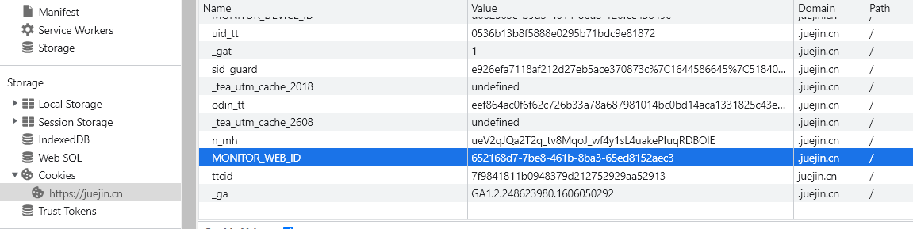
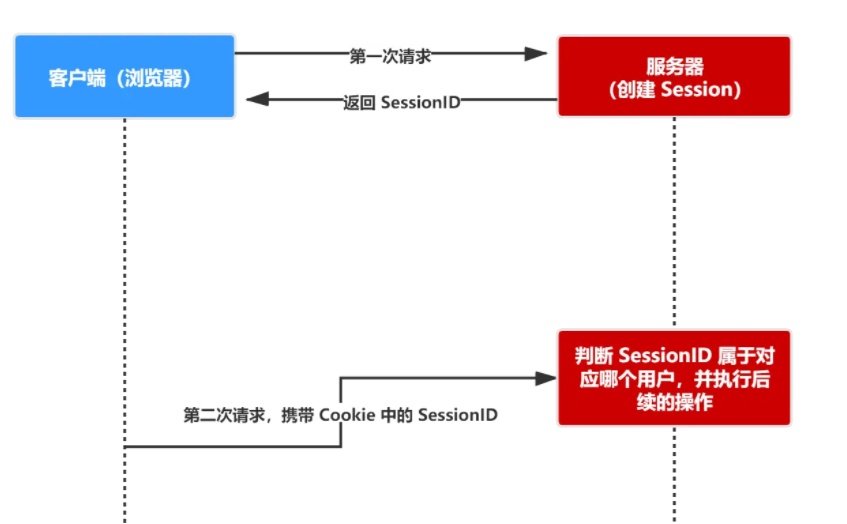
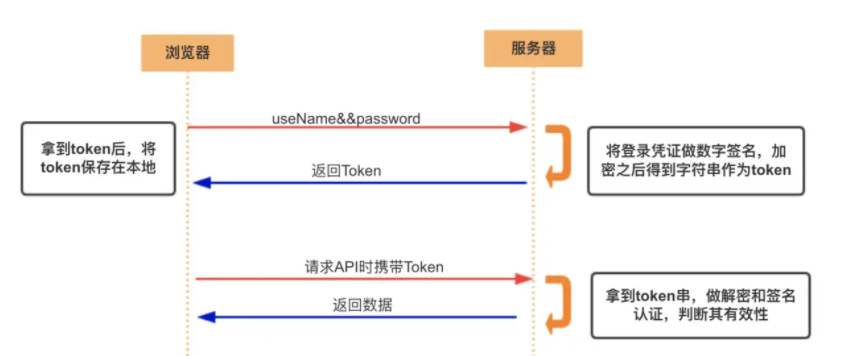

# cookie、token、session

[Cookie — JavaScript 标准参考教程（alpha）](https://javascript.ruanyifeng.com/bom/cookie.html)

[掘金](https://juejin.cn/post/6844904034181070861#heading-4)

[TOC]

## Http的无状态

HTTP 是无状态的。HTTP 请求方和响应方间无法维护状态，都是一次性的，它不知道前后的请求都发生了什么。

但是听歌，点赞，评论都是需要登录状态的；这个时候在这些请求的时候带上某种”**登录“**标志；这就是下面介绍的这三种

## Cookie

### 概述

Cookie 是服务器保存在浏览器的一小段文本信息，**每个 Cookie 的大小一般不能超过4KB**。浏览器每次向服务器发出请求，就会自动附上这段信息。

**Cookie 主要用来分辨两个请求是否来自同一个浏览器**，以及用来保存一些状态信息

### 属性

1. name（名字）
2. value（值）
3. Max-age/Expires（到期时间）
4. domain（域名）
5. path（路径）
6. `Secure`、`HttpOnly`

#### name、value

键值对就是cookie中的数据；如：

#### Max-age/Expires

- **`Expires`属性指定一个具体的到期时间**，到了指定时间以后，浏览器就不再保留这个 Cookie。

  如果不设置该属性，或者设为`null`，Cookie 只在当前会话（session）有效，浏览器窗口一旦关闭，当前 Session 结束，该 Cookie 就会被删除。另外，**浏览器根据本地时间，决定 Cookie 是否过期，由于本地时间是不精确的，所以没有办法保证 Cookie 一定会在服务器指定的时间过期。**

- `Max-Age`属性指定从现在开始 Cookie 存在的秒数，比如`60 * 60 * 24 * 365`（即一年）。过了这个时间以后，浏览器就不再保留这个 Cookie。

- **如果同时指定了`Expires`和`Max-Age`，那么`Max-Age`的值将优先生效。**

- 如果没有指定`Expires`或`Max-Age`属性，那么这个 Cookie 就是 Session Cookie，即它只在本次对话存在，一旦用户关闭浏览器，浏览器就不会再保留这个 Cookie。

#### Domain、Path

`Domain`属性指定浏览器发出 HTTP 请求时，哪些域名要附带这个 Cookie。如果没有指定该属性，浏览器会默认将其设为当前 URL 的一级域名，比如`www.example.com`会设为`example.com`，而且以后如果访问`example.com`的任何子域名，HTTP 请求也会带上这个 Cookie。如果服务器在`Set-Cookie`字段指定的域名，不属于当前域名，浏览器会拒绝这个 Cookie。

`Path`属性指定浏览器发出 HTTP 请求时，哪些路径要附带这个 Cookie。只要浏览器发现，`Path`属性是 HTTP 请求路径的开头一部分，就会在头信息里面带上这个 Cookie。比如，`PATH`属性是`/`，那么请求`/docs`路径也会包含该 Cookie。当然，前提是域名必须一致。

#### Secure、HttpOnly

`Secure`属性指定浏览器只有在加密协议 HTTPS 下，才能将这个 Cookie 发送到服务器。该属性只是一个开关，不需要指定值。如果通信是 HTTPS 协议，该开关自动打开。http协议会自动会略

`HttpOnly`属性指定该 Cookie 无法通过 JavaScript 脚本拿到，主要是`Document.cookie`属性、`XMLHttpRequest`对象和 Request API 都拿不到该属性。这样就防止了该 Cookie 被脚本读到，只有浏览器发出 HTTP 请求时，才会带上该 Cookie。

## Session

### 概念

和Cookie一样，`seesion`是另一种记录服务器和客户端会话状态的机制；session 是基于 cookie 实现的，**session 存储在服务器端**，**`sessionId` 会被存储到客户端的cookie 中**

### session和cookie的对比

- **安全性：** Session 比 Cookie 安全，Session 是存储在服务器端的，Cookie 是存储在客户端的。
- **存取值的类型不同**：Cookie 只支持存字符串数据，想要设置其他类型的数据，需要将其转换成字符串，Session 可以存任意数据类型。
- **有效期不同：** Cookie 可设置为长时间保持，比如我们经常使用的默认登录功能，Session 一般失效时间较短，客户端关闭（默认情况下）或者 Session 超时都会失效。
- **存储大小不同：** 单个 Cookie 保存的数据不能超过 4K，Session 可存储数据远高于 Cookie，但是当访问量过多，会占用过多的服务器资源。

## Token

### 概念

token就是认证令牌；

相比于在服务端找地方存session，甚至考虑分布式集群的问题，token的优点在于

- **服务端无状态化、可扩展性好**
- **支持移动端设备**
- 安全

### http请求是怎么处理携带token的呢？

- 第一次账号密码登录成功，拿到token
- 把token放在`web storage`中
- 在拦截请求的时候设置请求头 x-access-token 并赋值token

### 后端是怎么处理 token 的呢

- 后端从请求头中拿到 token并解析出一些数据，如 用户名，客户端（web，移动端）等数据
- 在网关处去拿token解析出来的数据进行鉴权判断

### token和session的区别

- **作用不同：**session 是一种记录服务器和客户端会话状态的机制，会记录会话信息；但是Token 是令牌，访问资源接口所需要的资源凭证。Token **不会存储会话信息。**
- **安全：**为身份认证 Token 安全性比 Session 好，因为每一个请求都有签名还能防止监听以及重放攻击，而 Session 就必须依赖链路层来保障通讯安全了。